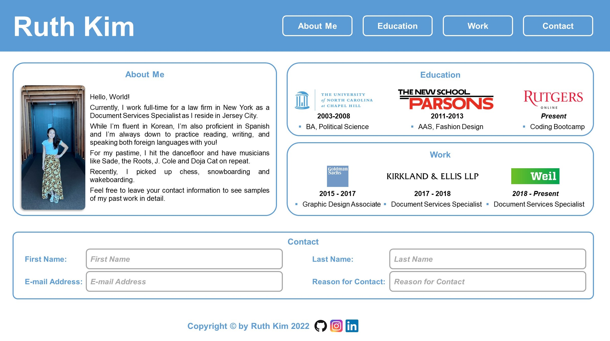

# Portfolio Draft

## User Story

```
AS AN employer seeking a front-end developer
I WANT an overview of the candidate's personality, education and work experience
SO THAT I can decide to contact him/her/them for further samples of his/her/their past work
```
## Acceptance Criteria

```
GIVEN I need to get a basic overview of the candidate
WHEN I load the portfolio
THEN I see the candidate's photo, name followed by navigation links to respective sections - interests, education, work experience
WHEN I want to contact the candidate for more information
THEN I can insert my contact info in contact form
WHEN I load the portfolio in different devices
THEN I am able to view with user-friendly layout without scrolling horizontally
```
## Wireframe for Draft Purposes Only



## Final Screenshot


## Link

